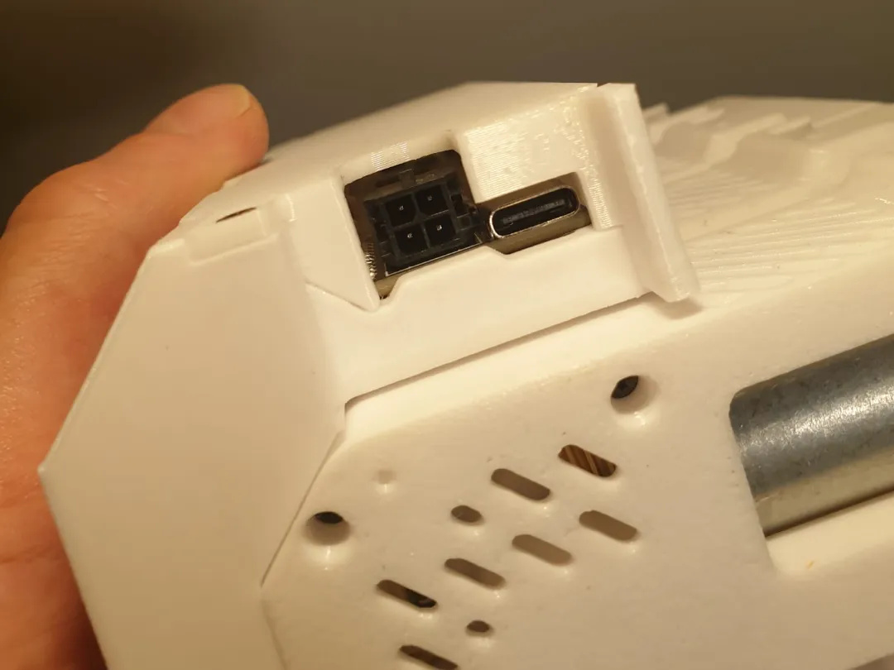
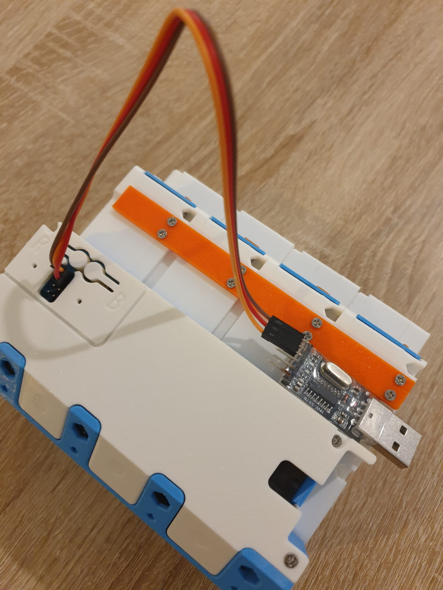
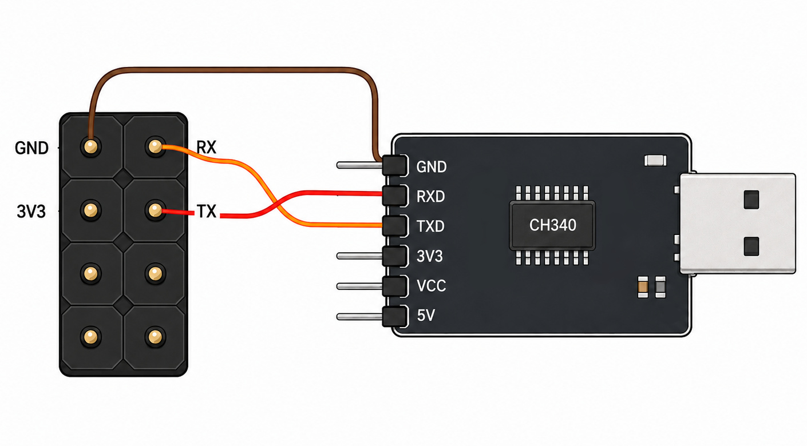
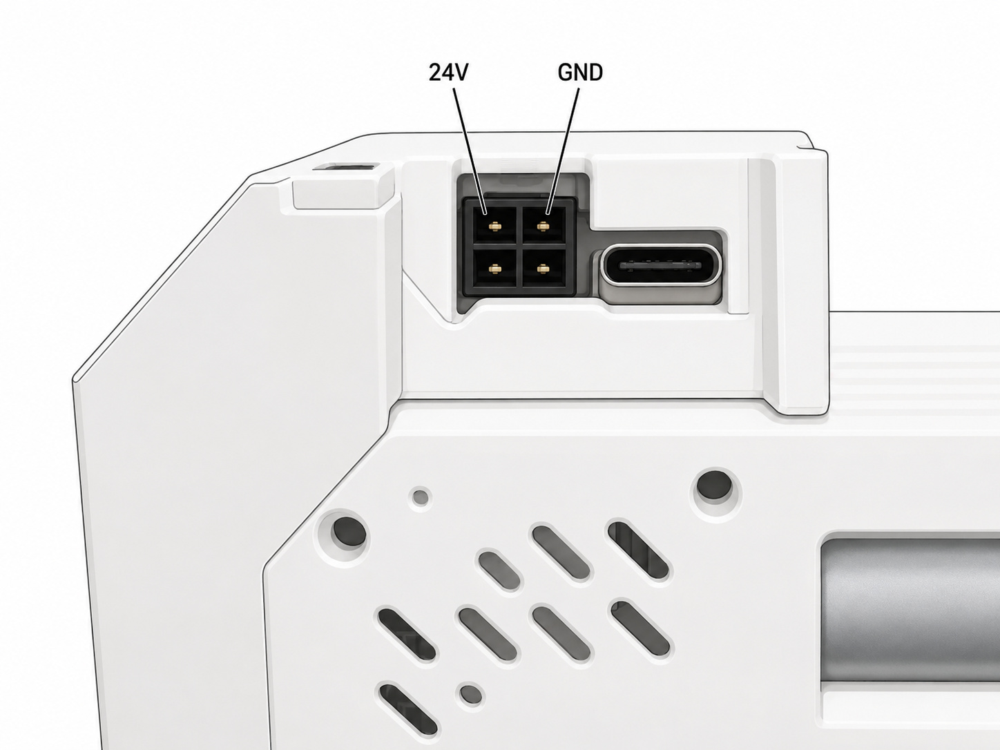
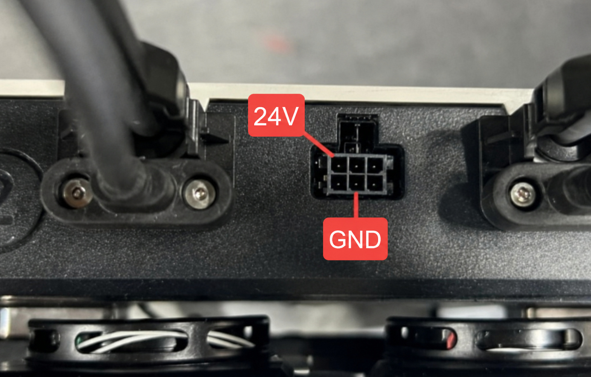

# Connecting BMCU

At present, two main BMCU board variants are known:

- a version with a USB connector and built-in CH340 interface,
- a TTL version with exposed UART pins.

Both versions require a separate `24V` power supply connected to BMCU.

## BMCU with built-in USB

In this version, CH340 is already present on the board. Connect BMCU directly to the printer host with a USB cable.



## BMCU TTL version

The TTL version does not have a built-in USB interface. An external CH340 USB-UART adapter is required. It is inexpensive, common and easy to find.

It is best to mount the CH340 close to BMCU, connect them with short wires and run a USB extension cable to the printer.

Connect only three lines:

```text
BMCU GND -> CH340 GND
BMCU TX  -> CH340 RX
BMCU RX  -> CH340 TX
```

Do not connect any power line from the CH340. The CH340 is powered from USB, while BMCU is powered separately from `24V`.

The UART connection is the same as when flashing BMCU through CH340, except for the `3.3V` line - do not connect it during normal operation.





## 24 V power

Regardless of the BMCU board version, `24V` and `GND` are used from the 4-pin power connector.



The best solution is a separate `24V` power supply. This keeps BMCU power independent from the printer.

You can also use `24V` available inside the printer if you know exactly which output you are using and what load it can handle.

### Snapmaker U1

On Snapmaker U1, `24V` and `GND` can optionally be taken from the upper 6-pin connector intended for the fan. I still recommend a separate BMCU power supply, but this option is convenient if you want to power the module directly from the printer.



The repository includes a helper that enables this output permanently:

```sh
./printers/Snapmaker_U1/enable-24v.sh
```

Run it as `root`. After a U1 firmware update, run the helper again if you still use this power method.

## Important

BMCU is an open DIY project and exists in many hardware implementations. Modules can be bought from many different AliExpress sellers, on the second-hand market, or assembled independently. They are produced by many people and companies, and quality is not the same everywhere.

There are also modules that are damaged or were never properly tested before sale. A seller's statement that a BMCU was tested does not guarantee that it actually was.

Be especially careful when taking power directly from the printer. In the worst case, a damaged module or incorrect wiring can damage the printer port or electronics.

You need to know what you are connecting and where the power comes from. I am responsible for the firmware and the BMCU-Klipper integration, not for the quality or condition of a particular BMCU module. The entire hardware side is your responsibility - as with almost any 3D printer modification.

Back to the [main README](../README.md).
